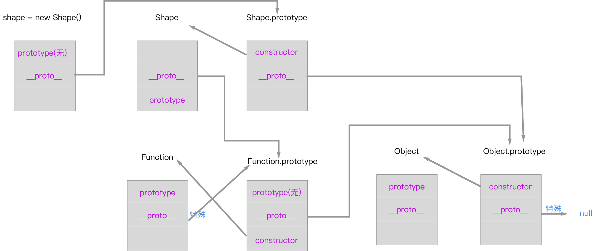
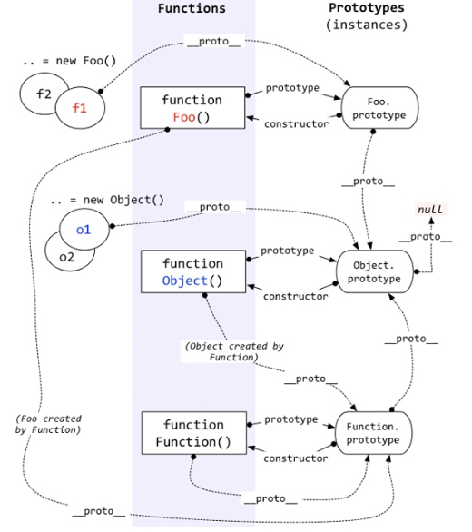

## 历史
- 1994年，网景公司（Netscape）发布了Navigator浏览器0.9版。
- 历史上第一个比较成熟的网络浏览器，轰动一时。但是，这个版本的浏览器只能用来浏览，不具备与访问者互动的能力.
- 网景公司急需一种网页脚本语言，使得浏览器可以与网页互动。
-  [Brendan Eich](http://brendaneich.com/)负责开发这种新语言
- 他觉得，没必要设计得很复杂，这种语言只要能够完成一些简单操作就够了，比如判断用户有没有填写表单。
- 他考虑到，C++和Java语言都使用new命令，生成实例。   
 
C++的写法：

```C++
ClassName *object = new ClassName(param);
```

Java的写法：

```Java
Foo foo = new Foo();
```
- 他想到C++和Java使用new命令时，都会调用"类"的构造函数（constructor）。
- 他就做了一个简化的设计，在Javascript语言中，new命令后面跟的不是类，而是构造函数。

比如：现在有一个叫做DOG的构造函数，表示狗对象的原型。

```javascript
    function DOG(name){
      this.name = name;
    }
```
使用 new 生成一个狗对象的实例

```javascript
    var dogA = new DOG('大毛');
    alert(dogA.name); // 大毛
```

## new运算符的缺点
用构造函数生成实例对象，有一个缺点，那就是无法共享属性和方法。

```javascript
　　function DOG(name){
　　　　this.name = name;
　　　　this.species = '犬科';
　　}
```
生成两个实例对象：

```javascript
    var dogA = new DOG('大毛');
    var dogB = new DOG('二毛');
```
这两个对象的species属性是独立的，修改其中一个，不会影响到另一个。

```javascript
　  dogA.species = '猫科';
　　alert(dogB.species); // 显示"犬科"，不受dogA的影响
```

## prototype属性的引入
考虑到这一点，Brendan Eich决定为构造函数设置一个prototype属性。

这个属性包含一个对象（以下简称"prototype对象"），所有实例对象需要**共享的属性和方法**，都放在这个对象里面；那些不需要共享的属性和方法，就放在构造函数里面。

```javascript
　　function DOG(name){
　　　　this.name = name;
　　}
　　DOG.prototype = { species : '犬科' };

　　var dogA = new DOG('大毛');
　　var dogB = new DOG('二毛');

　　alert(dogA.species); // 犬科
　　alert(dogB.species); // 犬科
```
species属性放在prototype对象里，是两个实例对象共享的。只要修改了prototype对象，就会同时影响到两个实例对象。

```javascript
   DOG.prototype.species = '猫科';

　　alert(dogA.species); // 猫科
　　alert(dogB.species); // 猫科
```
这就是Javascript继承机制的设计思想。

## 原型链


- __proto__ 指向当前构造函数的原型

- JavaScript中任意对象都有一个内置属性[[prototype]]，在ES5之前没有标准的方法访问这个内置属性，但是大多数浏览器都支持通过__proto__来访问。ES5中有了对于这个内置属性标准的Get方法Object.getPrototypeOf().

- Object.prototype 这个对象是个例外，它的__proto__值为null 


- 在JS里，万物皆对象。方法（Function）是对象，方法的原型(Function.prototype)是对象。因此，它们都会具有对象共有的特点。
- 即：对象具有属性__proto__，可称为隐式原型，一个对象的隐式原型指向构造该对象的构造函数的原型，这也保证了实例能够访问在构造函数原型中定义的属性和方法。

- 方法(Function)方法这个特殊的对象，除了和其他对象一样有上述_proto_属性之外，还有自己特有的属性——原型属性（prototype），这个属性是一个指针，指向一个对象，这个对象的用途就是包含所有实例共享的属性和方法（我们把这个对象叫做原型对象）。原型对象也有一个属性，叫做constructor，这个属性包含了一个指针，指回原构造函数。




- 1.构造函数Foo()
  - 构造函数的原型属性Foo.prototype指向了原型对象，在原型对象里有共有的方法，所有构造函数声明的实例（这里是f1，f2）都可以共享这个方法。

- 2.原型对象Foo.prototype
 - Foo.prototype保存着实例共享的方法，有一个指针constructor指回构造函数。
 - constructor属性的作用：个人理解是为了让所有的实例，能够访问构造函数
 
- 3.实例
f1和f2是Foo这个对象的两个实例，这两个对象也有属性__proto__，指向构造函数的原型对象，这样子就可以像上面1所说的访问原型对象的所有方法啦。

- 构造函数Foo()除了是方法，也是对象啊，它也有__proto__属性，指向谁呢？函数的构造函数就是Function，因此这里的__proto__指向了Function.prototype。其实除了Foo()，Function(), Object()也是一样的道理。

- 原型对象也是对象啊，它的__proto__属性，又指向谁呢？
  同理，指向它的构造函数的原型对象呗。这里是Object.prototype.
  
-总结：
  - 1.对象有属性__proto__,指向该对象的构造函数的原型对象。
  - 2.方法除了有属性__proto__,还有属性prototype，prototype指向该方法的原型对象。
  - __proto__是每个对象都有的一个属性，而prototype是函数才会有的属性。


## 类继承
```javascript

class Point {
}

class ColorPoint extends Point {
  constructor(x, y, color) {
    super(x, y); // 调用父类的constructor(x, y)
    this.color = color;
  }

  toString() {
    return this.color + ' ' + super.toString(); // 调用父类的toString()
  }
}
```

- 子类必须在constructor方法中调用super方法，否则新建实例时会报错。这是因为子类没有自己的this对象，而是继承父类的this对象，然后对其进行加工。如果不调用super方法，子类就得不到this对象。

- 类的原型方法不可枚举


```javascript
    
    class Point {
      constructor(x, y) {
        // ...
      }
    
      toString() {
        // ...
      }
    }
    
    Object.keys(Point.prototype)
    // []
    Object.getOwnPropertyNames(Point.prototype)
    // ["constructor","toString"]

```

- 子类的__proto__属性，表示构造函数的继承，总是指向父类。
  
- 子类prototype属性的__proto__属性，表示方法的继承，总是指向父类的prototype属性。


```javascript

class A {
}

class B extends A {
}

B.__proto__ === A // true
B.prototype.__proto__ === A.prototype // true

```

这样的结果是因为，类的继承是按照下面的模式实现的。

```javascript
class A {
}

class B {
}

// B 的实例继承 A 的实例
Object.setPrototypeOf(B.prototype, A.prototype);

// B 的实例继承 A 的静态属性
Object.setPrototypeOf(B, A);

const b = new B();
```

Object.setPrototypeOf方法的实现。

```javascript
Object.setPrototypeOf = function (obj, proto) {
  obj.__proto__ = proto;
  return obj;
}
```

## 类重写 与 new.target 与 高阶组件

- 类重写
查看 banner实例 

- new是从构造函数生成实例的命令。ES6 为new命令引入了一个new.target属性，该属性一般用在构造函数之中，返回new命令作用于的那个构造函数。如果构造函数不是通过new命令调用的，new.target会返回undefined，因此这个属性可以用来确定构造函数是怎么调用的。

```javascript
class Shape {
  constructor() {
    if (new.target === Shape) {
      throw new Error('本类不能实例化');
    }
  }
}
class Rectangle extends Shape {
  constructor(length, width) {
    super();
    // ...
  }
}
var x = new Shape();  // 报错
var y = new Rectangle(3, 4);  // 正确

```

- 类重写，相当于是从类的内部增强；高阶组件，相当于从类的外部进行武装。

